# Koda — Visual Feature Guide

> Este arquivo documenta todas as screenshots do Koda, explicando cada funcionalidade mostrada.

---

## Interface Principal

### Imagem 1 — Tela Inicial (Modern UI)
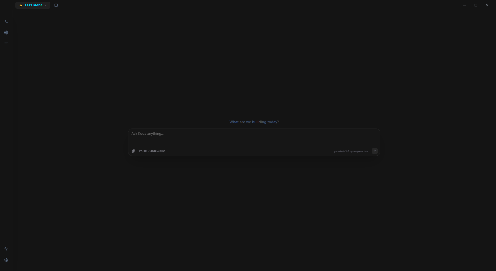

A tela inicial do Koda no modo **Modern Pro**. Mostra o layout padrão ao abrir o app com uma sessão vazia:
- **PromptBox** centralizado com o placeholder `"Ask Koda anything..."`
- **Tagline** `"What are we building today?"` acima do input
- Barra lateral esquerda com ícones de navegação (Terminal, Browser, Histórico, Configurações)
- **Mode Selector** no topo esquerdo mostrando `⚡ FAST MODE`
- Indicador do modelo ativo (`gemini-3.1-pro-preview`) e diretório de trabalho (`PATH: ~/Koda Electron`)

---

### Imagem 2 — Painel de Histórico de Sessões
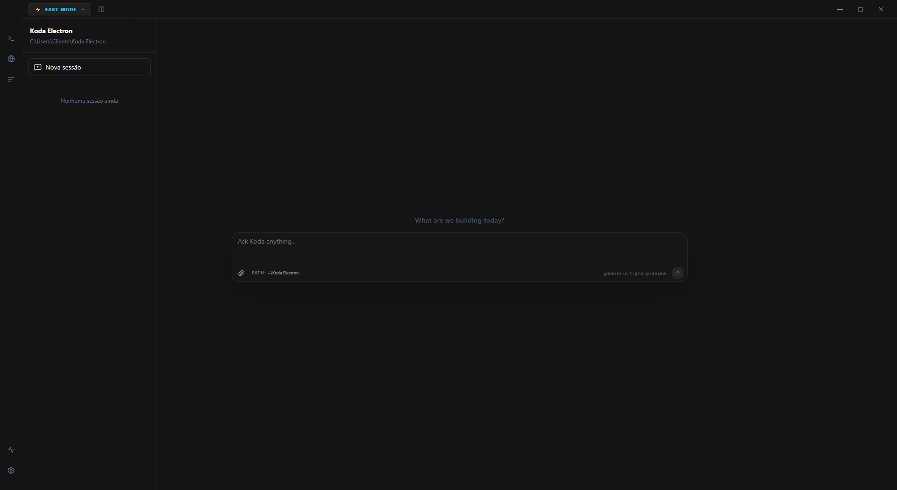

Painel lateral de **histórico de sessões** aberto. Permite ao usuário:
- Ver o projeto atual (`Koda Electron`) e seu caminho
- Criar uma nova sessão com o botão `+ Nova sessão`
- Acessar conversas anteriores salvas por projeto (aqui vazio: *"Nenhuma sessão ainda"*)

Cada sessão é armazenada no `localStorage` do Electron, separada por projeto.

---

## Terminal Integrado

### Imagem 3 — Terminal Flutuante
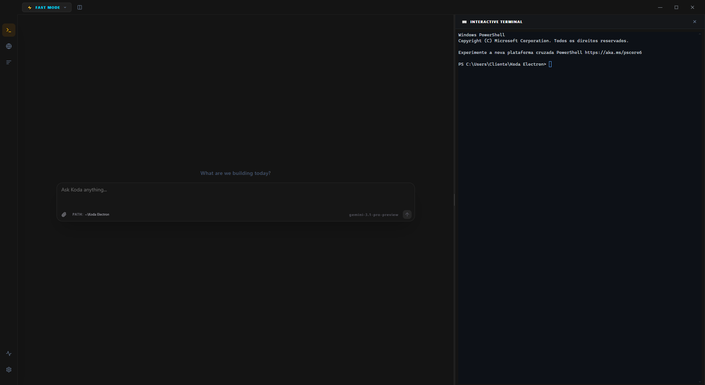

O **Interactive Terminal** aberto como painel flutuante à direita. Exibe um shell PowerShell real rodando diretamente no contexto do projeto (`C:\Users\Cliente\Koda Electron`). O Koda usa `node-pty` para spawnar processos nativos, permitindo:
- Executar comandos enquanto conversa com o agente
- Visualizar output de processos em tempo real
- Fechar o terminal via o `×` no canto

---

## Browser Integrado

### Imagem 4 — Browser Interno (Lado Direito)
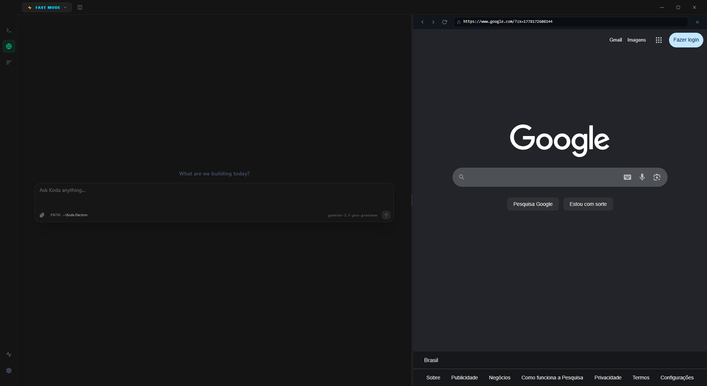

O **browser embutido** do Koda aberto à direita, exibindo o Google. Permite ao agente navegar e ao usuário pesquisar sem sair do app. O chat continua visível à esquerda, permitindo trabalho em paralelo.

---

### Imagem 5 — Browser + Terminal Empilhados
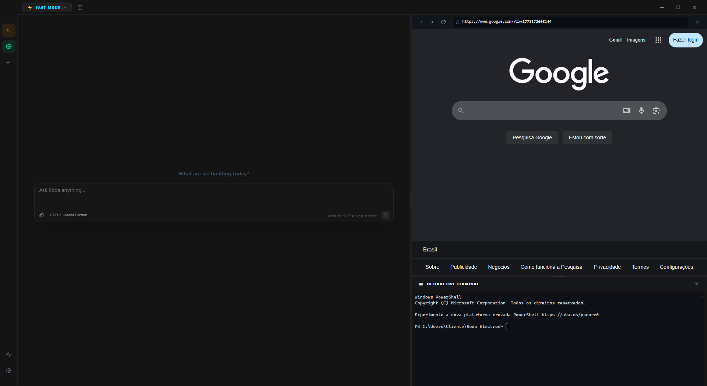

Browser e Terminal **empilhados verticalmente** no painel direito simultaneamente. O Koda suporta múltiplos painéis no mesmo lado — eles se organizam em split vertical. Útil para pesquisar algo no browser enquanto monitora output do terminal.

---

## Painel de Contexto

### Imagem 6 — Context Panel (Aba Context)
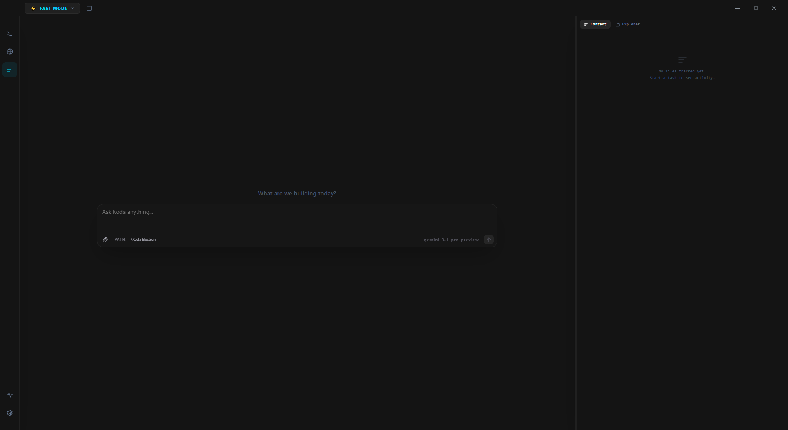

O **Context Panel** aberto na aba `Context`. Quando vazio mostra *"No files tracked yet. Start a task to see activity."*. À medida que o agente trabalha, os arquivos que ele lê/edita aparecem aqui. Também há a aba `Explorer` para navegar pelo projeto manualmente.

---

### Imagem 7 — File Explorer (Aba Explorer)
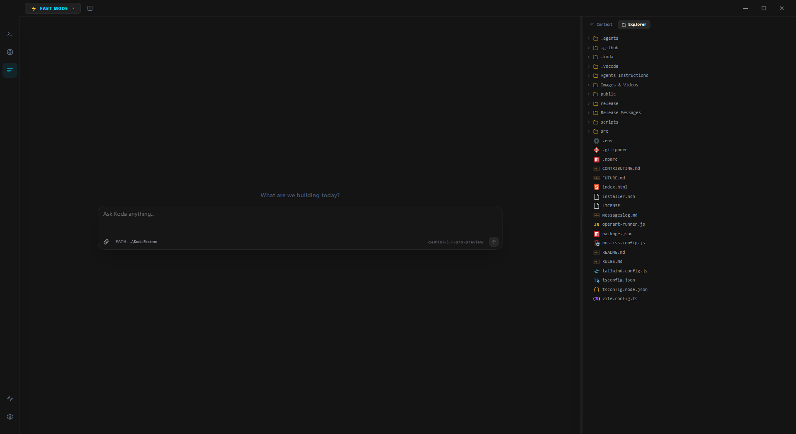

A aba **Explorer** do Context Panel, exibindo a árvore de arquivos do projeto Koda Electron com ícones por tipo (`.env`, `.gitignore`, `.npmrc`, `.md`, `.html`, `.js`, `.json`, `.ts`). Permite ao usuário clicar em qualquer arquivo para injetá-lo no contexto do agente.

---

## Slash Commands

### Imagem 8 — Menu de Slash Commands (`/`)
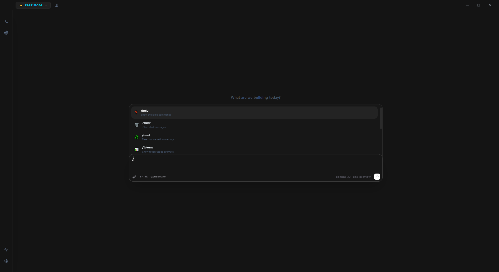

Ao digitar `/` no PromptBox, abre o **slash menu** com comandos rápidos:
- `/help` — Mostra comandos disponíveis
- `/clear` — Limpa as mensagens do chat
- `/reset` — Reseta a memória de conversação
- `/tokens` — Exibe estimativa de uso de tokens

---

## Menção de Arquivos (`@`)

### Imagem 9 — File Mention Menu (`@`)
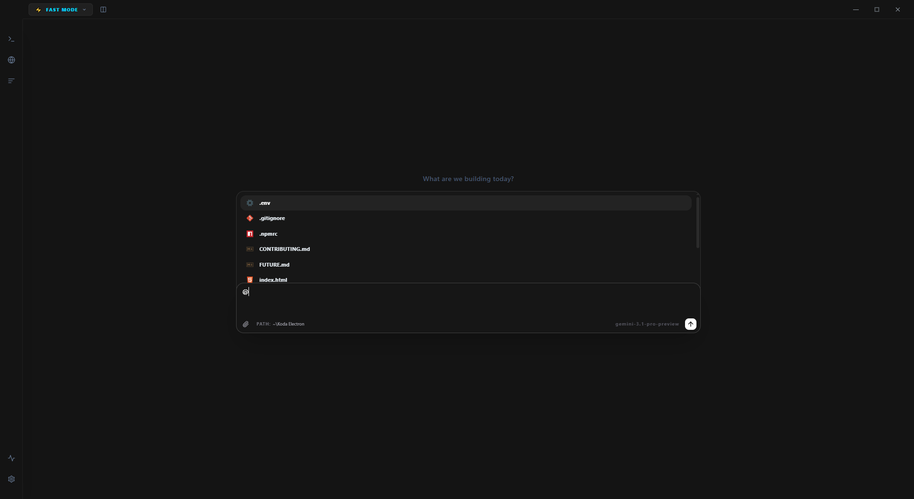

Ao digitar `@` no PromptBox, aparece o **file suggestion menu** com ícones estilo vscode-icons para cada tipo de arquivo. Permite mencionar arquivos do projeto diretamente na mensagem, injetando seu conteúdo no contexto enviado ao modelo.

---

## MCP Management

### Imagem 10 — MCP Management (Vazio)
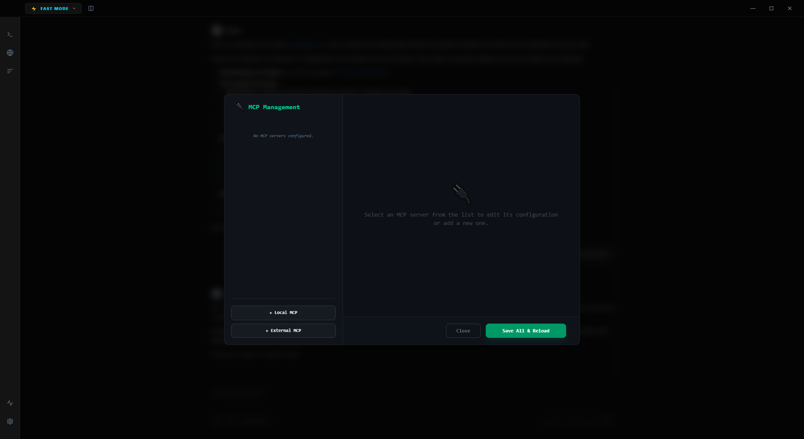

Tela de gerenciamento de servidores **MCP (Model Context Protocol)**. Exibe a lista de servidores configurados (aqui vazia: *"No MCP servers configured"*) e os botões para adicionar:
- `+ Local MCP` — Servidor local via processo
- `+ External MCP` — Servidor remoto via SSE

---

### Imagem 11 — Adicionar MCP Local
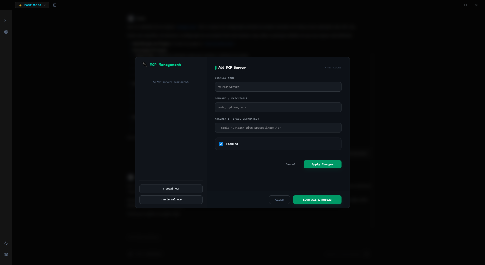

Formulário para adicionar um **MCP Local** (tipo: `LOCAL`). Campos:
- **Display Name** — Nome do servidor
- **Command / Executable** — Ex.: `node`, `python`, `npx`
- **Arguments** — Ex.: `--stdio "C:\path\index.js"`
- **Enabled** — Toggle para ativar/desativar

---

### Imagem 12 — Adicionar MCP Externo
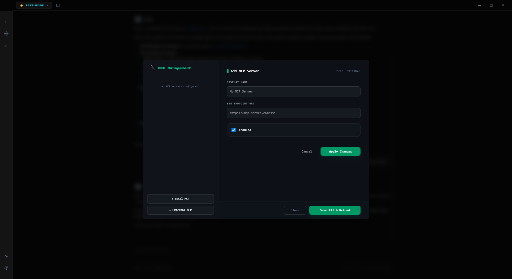

Formulário para adicionar um **MCP Externo** (tipo: `EXTERNAL`). Campos:
- **Display Name** — Nome do servidor
- **SSE Endpoint URL** — Ex.: `https://mcp-server.com/sse`
- **Enabled** — Toggle para ativar/desativar

Ideal para conectar ferramentas de terceiros via Server-Sent Events.

---

## Configurações

### Imagem 13 — Settings: API & Models
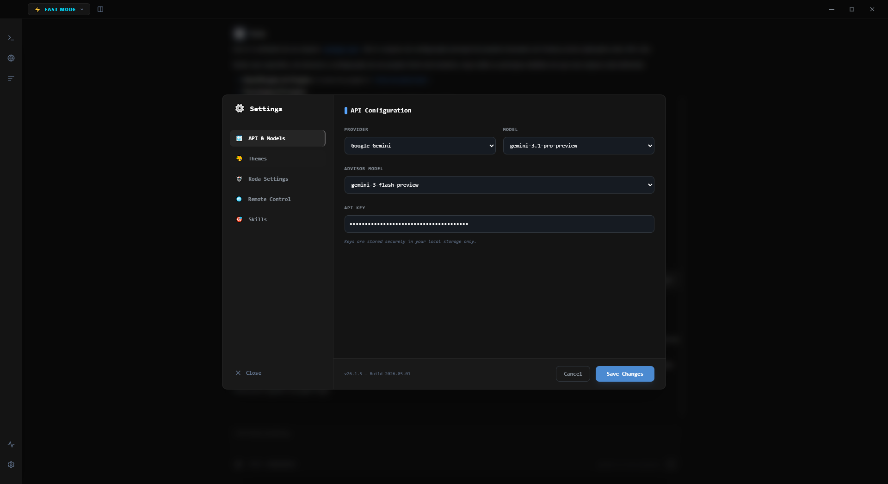

Tela de configurações, seção **API & Models**:
- **Provider** — Seletor do provedor de IA (aqui: `Google Gemini`)
- **Model** — Modelo principal (aqui: `gemini-3.1-pro-preview`)
- **Advisor Model** — Modelo secundário para planejamento (aqui: `gemini-3-flash-preview`)
- **API Key** — Campo seguro para inserir a chave de API
- Rodapé com versão: `v26.1.5 — Build 2026.05.01`

---

### Imagem 14 — Settings: Themes
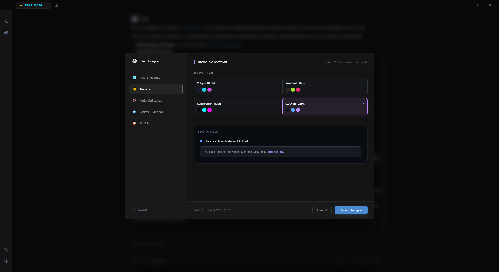

Seção de **temas** do Koda. Exibe 4 temas disponíveis em grid com preview de cores:
- **Tokyo Night** — Azul/magenta
- **Monokai Pro** — Amarelo/vermelho
- **Cyberpunk Neon** — Ciano/magenta
- **GitHub Dark** ✓ — Roxo/azul (selecionado)

Inclui um **Live Preview** mostrando como o texto e o código aparecerão.

---

### Imagem 15 — Settings: Koda Settings (Workspace Layout)
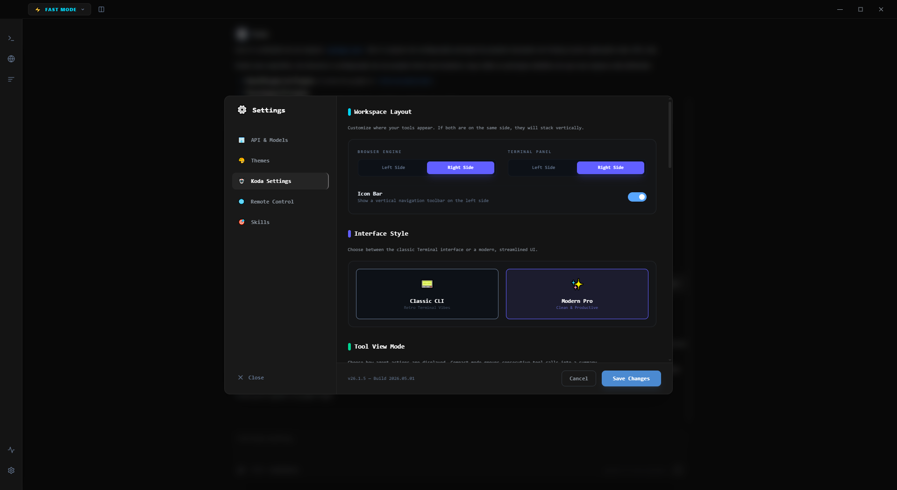

Seção **Koda Settings** mostrando opções de layout:
- **Workspace Layout** — Define em qual lado o Browser Engine e o Terminal Panel aparecem (Left / Right)
- **Icon Bar** — Toggle para exibir/ocultar a barra de navegação lateral
- **Interface Style** — Escolha entre dois modos:
  - `Classic CLI` — Interface retrô estilo terminal
  - `Modern Pro` ✓ — UI moderna e limpa (selecionado)
- **Tool View Mode** — Como as ações do agente são exibidas (abaixo da tela)

---

### Imagem 16 — Settings: Tool View Mode & Output Verbosity
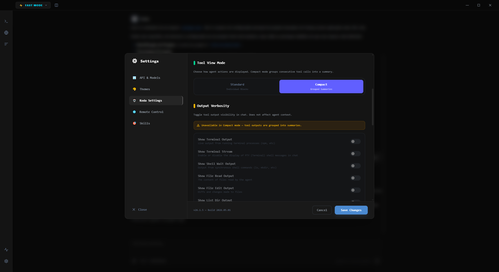

Continuação da seção **Koda Settings**:
- **Tool View Mode** — `Standard` (blocos individuais) ou `Compact` ✓ (grupos sumarizados)
- **Output Verbosity** — Toggles individuais para mostrar/ocultar cada tipo de output no chat:
  - Show Terminal Output
  - Show Terminal Stream
  - Show Shell Wait Output
  - Show File Read Output
  - Show File Edit Output
  - Show List Dir Output

> ⚠️ No modo Compact, os outputs são agrupados em sumários e os toggles ficam desabilitados.

---

### Imagem 17 — Settings: Integrations & Approved Commands
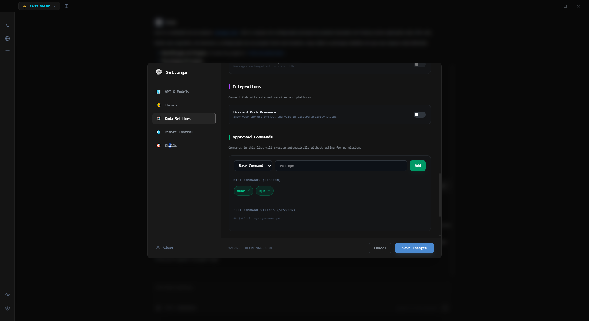

Seção inferior do **Koda Settings**:
- **Discord Rich Presence** — Integração que mostra o projeto/arquivo atual no status do Discord
- **Approved Commands** — Lista de comandos que o agente pode executar automaticamente sem pedir permissão:
  - Por base de comando (`node`, `npm` já aprovados)
  - Por string completa de comando

---

### Imagem 18 — Settings: Remote Control
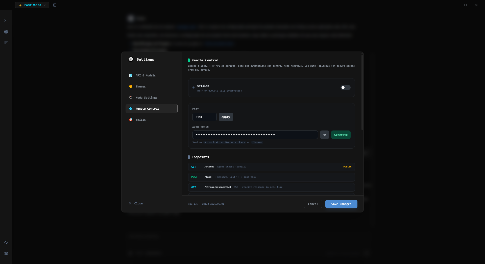

Seção **Remote Control** — expõe uma API HTTP local para controlar o Koda remotamente via scripts, bots ou automações:
- **Status** — Online/Offline com toggle
- **Port** — Porta do servidor (padrão: `3141`)
- **Auth Token** — Token Bearer para autenticação
- **Endpoints** disponíveis:
  - `GET /status` — Status do agente (público)
  - `POST /task` — Envia uma tarefa com `{message, wait?}`
  - `GET /stream/:messageId` — Recebe resposta em tempo real via SSE

---

### Imagem 19 — Settings: Skills Marketplace
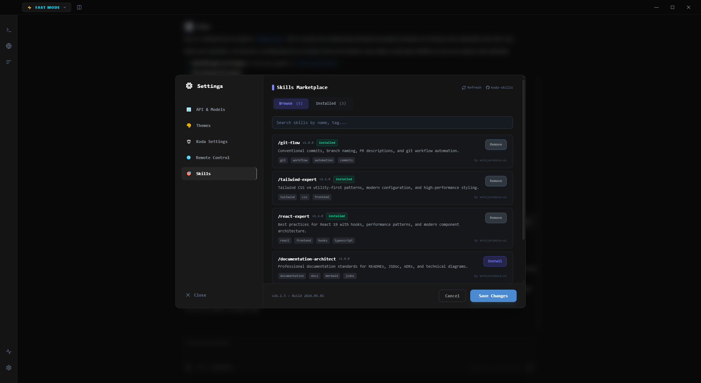

O **Skills Marketplace** — sistema de plugins que estendem as instruções do agente com habilidades especializadas:
- Abas `Browse (5)` e `Installed (3)`
- Campo de busca por nome/tag
- Skills instaladas com badge `installed` e botão `Remove`:
  - `/git-flow` — Commits convencionais, branch naming, PRs
  - `/tailwind-expert` — Padrões Tailwind CSS v4
  - `/react-expert` — Boas práticas React 19
- Skills disponíveis com botão `Install`:
  - `/documentation-architect` — READMEs, JSDoc, diagramas

---

## Multi-Workspace

### Imagem 20 — Multi-Workspace (2 Abas)
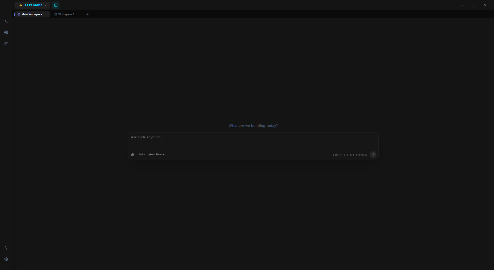

Modo **Multi-Workspace** com duas abas no topo (`Main Workspace` e `Workspace 2`). Cada workspace é uma sessão independente com seu próprio contexto, histórico e agente. Clique no `+` para adicionar mais.

---

### Imagem 21 — Split View (2 Workspaces Lado a Lado)
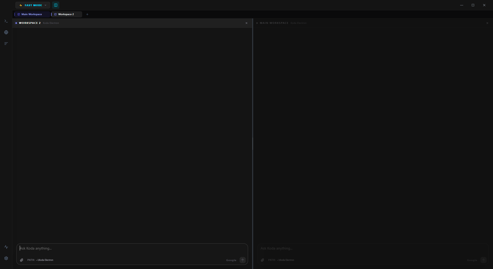

**Split View** ativo: dois workspaces exibidos simultaneamente em layout horizontal. Cada lado tem seu próprio PromptBox, caminho e modelo. Permite rodar dois agentes em paralelo — por exemplo, um construindo o backend enquanto o outro trabalha no frontend.

---

## IDE Mode

### Imagem 22 — IDE Mode: Explorer + Chat
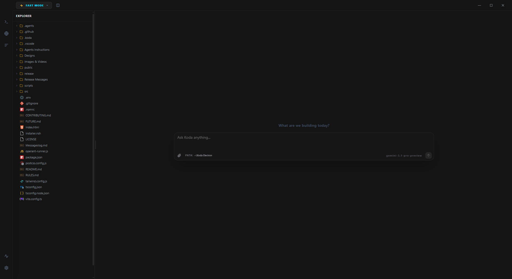

**IDE Mode** com apenas o Explorer ativado. O painel esquerdo exibe a árvore de arquivos do projeto e o chat ocupa o espaço restante à direita. Combina navegação de arquivos com conversa direta com o agente.

---

### Imagem 23 — IDE Mode: Editor + Chat (Sem Arquivo)
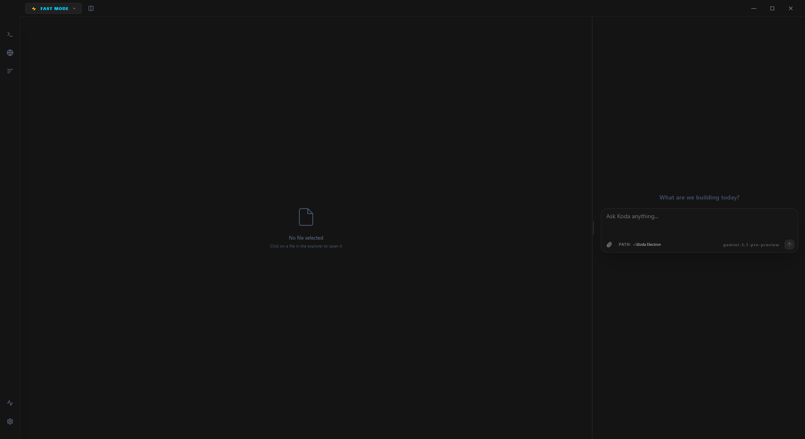

**IDE Mode** com Editor Panel ativado mas sem arquivo aberto. O editor central mostra *"No file selected — Click on a file in the explorer to open it"*. O chat fica comprimido à direita com seu próprio PromptBox.

---

### Imagem 24 — IDE Mode: Explorer + Editor Vazio + Chat
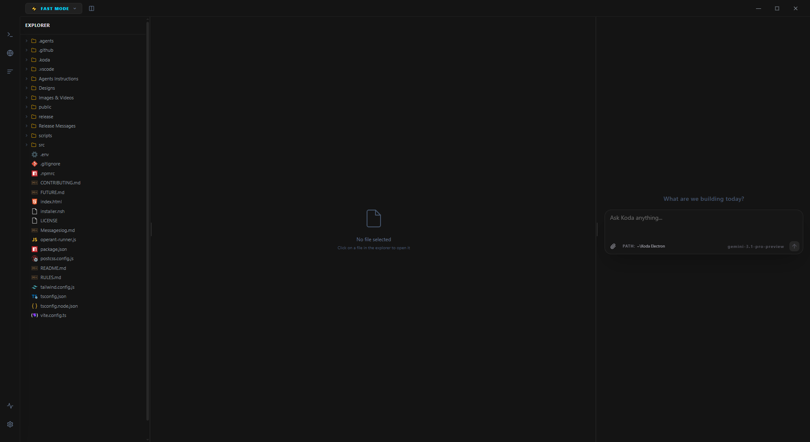

**IDE Mode** com Explorer à esquerda + Editor Monaco no centro (sem arquivo aberto) + Chat à direita. O editor exibe o estado vazio: *"No file selected — Click on a file in the explorer to open it"*. Demonstra o layout de três colunas antes de qualquer arquivo ser aberto.

---

### Imagem 25 — IDE Mode: Explorer + Editor com README.md (raw)
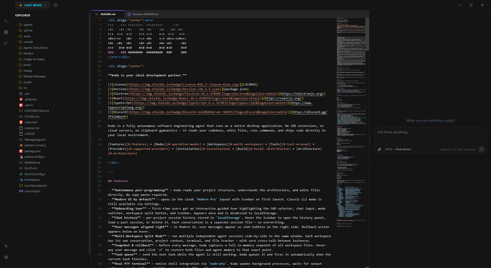

**IDE Mode** com o `README.md` aberto no Editor Monaco, exibindo o código markdown cru (raw) com syntax highlighting. No topo do editor aparecem duas abas: `README.md` (edição) e `Preview: README.md` (preview renderizado), demonstrando o suporte a Markdown side-by-side.

---

### Imagem 26 — IDE Mode: Markdown Preview do README
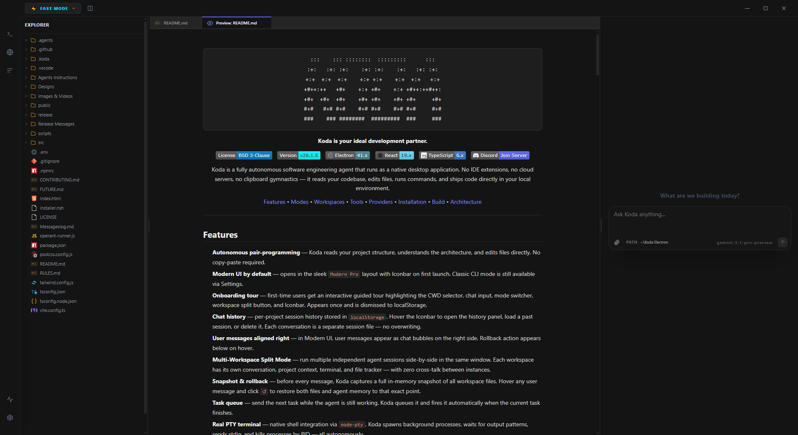

O editor em modo **Markdown Preview** renderizando o `README.md` do Koda como HTML. Exibe o logo ASCII, badges (License, Version, Electron, React, TypeScript, Discord) e a descrição completa do projeto formatados. Demonstra o preview in-app de documentação sem precisar sair do Koda.

---

### Imagem 27 — IDE Mode: Visualizador de Imagem (icon.png)
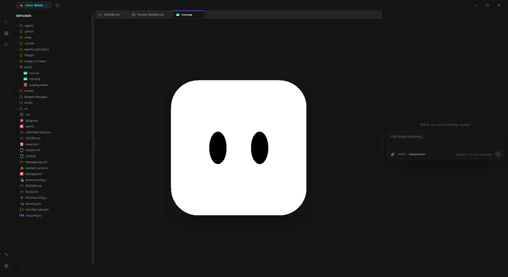

O editor abrindo um arquivo de imagem (`icon.png`) — o ícone do Koda, um rosto estilizado com dois olhos ovais em fundo branco arredondado. Demonstra o **Image Viewer** integrado ao IDE, sem necessidade de abrir o arquivo em um app externo.

---

### Imagem 28 — IDE Mode: Visualizador de Vídeo (Loading.webm)
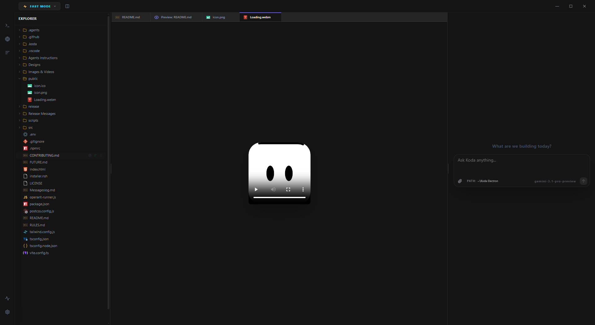

O editor abrindo um arquivo de vídeo (`Loading.webm`) — a animação de loading do Koda com o mesmo rosto do ícone. Demonstra o **Video Player** integrado ao IDE com controles nativos (play, volume, fullscreen, opções). As abas anteriores (`README.md`, `Preview`, `icon.png`) continuam abertas no editor.

---

### Imagem 29 — IDE Mode: Explorer + Editor + Browser + Terminal + Chat
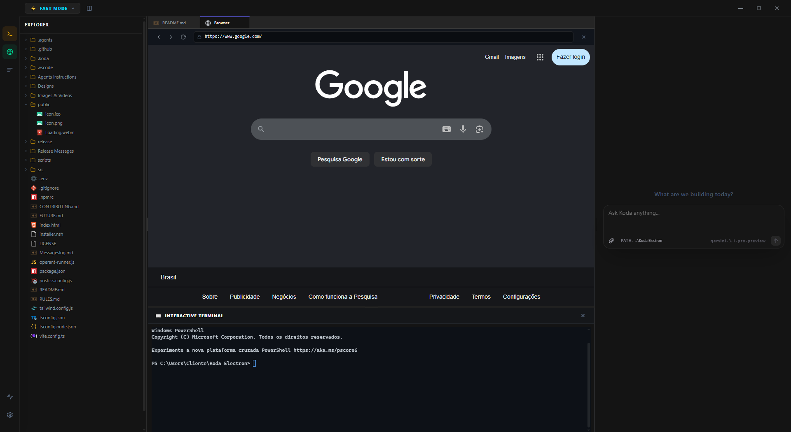

Esta imagem demonstra o **Koda em sua capacidade máxima de multitarefa**. Estão ativos simultaneamente:
- **Explorer** à esquerda navegando nos arquivos.
- **Editor Monaco** no centro com o `README.md` aberto.
- **Browser Interno** e **Terminal Interativo** empilhados verticalmente no centro-direita.
- **Chat Panel** à direita para interação contínua com o agente.

Este layout prova a flexibilidade do Koda para desenvolvedores que precisam de todas as ferramentas ao alcance de um clique sem trocar de janela.

---

## Referência Rápida

| Imagem | Feature |
|--------|---------|
| 1 | Tela inicial — Modern UI |
| 2 | Histórico de sessões |
| 3 | Terminal flutuante |
| 4 | Browser integrado |
| 5 | Browser + Terminal empilhados |
| 6 | Context Panel (arquivos rastreados) |
| 7 | File Explorer |
| 8 | Slash commands (`/`) |
| 9 | File mention (`@`) |
| 10 | MCP Management (vazio) |
| 11 | Adicionar MCP Local |
| 12 | Adicionar MCP Externo |
| 13 | Settings: API & Models |
| 14 | Settings: Themes |
| 15 | Settings: Workspace Layout & Interface Style |
| 16 | Settings: Tool View Mode & Output Verbosity |
| 17 | Settings: Integrations & Approved Commands |
| 18 | Settings: Remote Control API |
| 19 | Skills Marketplace |
| 20 | Multi-Workspace (abas) |
| 21 | Split View (dois workspaces lado a lado) |
| 22 | IDE Mode: Explorer + Chat |
| 23 | IDE Mode: Editor vazio + Chat (sem Explorer) |
| 24 | IDE Mode: Explorer + Editor vazio + Chat |
| 25 | IDE Mode: Explorer + Editor com README.md (raw) |
| 26 | IDE Mode: Markdown Preview do README |
| 27 | IDE Mode: Image Viewer (icon.png) |
| 28 | IDE Mode: Video Player (Loading.webm) |
| 29 | IDE Mode: Explorer + Editor + Browser + Terminal + Chat |
