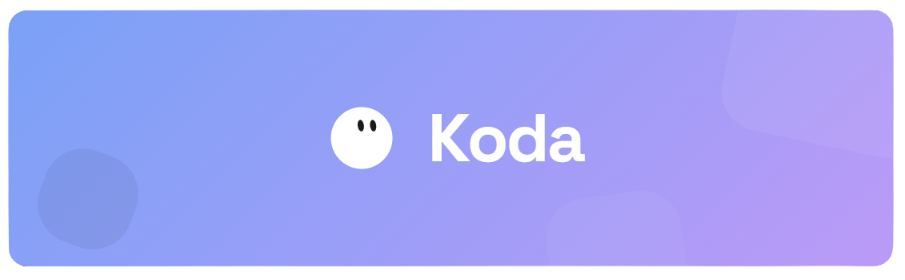

<div align="center">
  
</div>

<div align="center">

**Koda is your ideal development partner.**

[](package.json)
[](https://discord.gg/7FtCkNunYF)
[](https://apoie.pedrodev.top)
[](https://koda.harpiaresearch.cc/)

Koda is an Open-Source Agent Development Environment (ADE) for AI-assisted software engineering. No IDE extensions, no cloud servers, no clipboard gymnastics — it reads your codebase, edits files, runs commands, and ships code directly in your local environment.

[Features](#-features) • [Modes](#-operation-modes) • [Workspaces](#-multi-workspace) • [Tools](#-tool-arsenal) • [Providers](#-supported-providers) • [KoClaw](#koclaw--agent-api) • [Installation](#-installation) • [Build](#-build--distribution) • [Architecture](#-architecture)

</div>

---

## Features

- **Autonomous pair-programming** — Koda reads your project structure, understands the architecture, and edits files directly. No copy-paste required.
- **Modern UI by default** — opens in the sleek `Modern Pro` layout with Iconbar on first launch. Classic CLI-inspired mode is still available via Settings.
- **Sidebar always open** — the Iconbar is open by default on every launch, showing the session history panel immediately.
- **Project & branch indicator** — above the chat input, Koda shows the current project folder and, when the directory is a Git repo, the active branch with a dropdown to switch branches (local and remote) without leaving the app.
- **Source Control panel** — built-in Git panel accessible from the TitleBar. Shows staged and unstaged files with vscode-icons, supports per-file stage/unstage, stage all, commit with message, and push — all without leaving the app.
- **Readable model names** — the model selector displays human-friendly names (`Claude Sonnet 4`, `GPT-4o Mini`, `Gemini 2.5 Flash`) instead of raw API slugs.
- **Onboarding tour** — first-time users get an interactive guided tour highlighting the CWD selector, chat input, mode switcher, workspace split button, and Iconbar. Appears once, dismissed to localStorage.
- **Chat history** — per-project session history stored in `localStorage`. Open the history panel from the Iconbar, load a past session, or delete it. Each conversation is a separate session — no overwriting.
- **Multi-Workspace Split Mode** — run multiple independent agent sessions side-by-side in the same window. Each workspace has its own conversation, project context, terminal, and file tracker with zero cross-talk between instances.
- **Snapshot & rollback** — before every message, Koda captures a full in-memory snapshot of all workspace files. Hover any user message and click `↺` to restore both files and agent memory to that exact point.
- **Task queue** — send the next task while the agent is still working. Koda queues it and fires it automatically when the current task finishes.
- **Real PTY terminal** — native shell integration via `node-pty`. Koda spawns background processes, waits for output patterns, sends stdin, and kills processes by PID — all autonomously.
- **Interactive terminal panel** — a full `xterm.js` terminal for you to use directly, independent of the agent, with resize support and ANSI rendering.
- **Built-in browser preview** — a `<webview>`-based browser panel with navigation controls and mobile/desktop UA switching, defaulting to `localhost:5173`.
- **Web navigation agent** — via [`operantid.js`](https://www.npmjs.com/package/operantid.js), Koda can spawn a sub-agent that controls a real browser to navigate, interact with UI elements, and extract data from websites.
- **Questions tool** — the agent can ask up to 10 clarifying questions before acting. Presented as a wizard panel above the chat input, supporting single and multiple-choice options. Blocks execution until all answers are submitted.
- **Shell approval panel** — shell approval requests appear as an inline panel above the chat input with Accept (Once / Base / Full) and Deny options.
- **`.kodaignore` support** — create a `.kodaignore` file in your project root (same syntax as `.gitignore`) to restrict Koda's access to specific files or folders.
- **4 operation modes** — Fast, Planner, Colab, and Teach & Code, selectable from a dropdown in the TitleBar.
- **Skills system** — Markdown-based skill files inject specialized instructions into the agent's context on demand. Invoke with `/skill-name` or let the agent load them autonomously. Global skills in `~/.koda/skills/`, project-local in `.koda/skills/`.
- **Dynamic slash menu** — typing `/` opens a live-filtered dropdown listing all native commands and available skills.
- **Inline diff viewer** — `file_edit` outputs render as a side-by-side visual diff with line numbers.
- **System notifications** — native OS notification fires when a long task (>3s) completes and the window is not in focus.
- **Discord Rich Presence** — optional Discord RPC integration showing current project and agent status.
- **KoClaw — Agent API** — built-in HTTP server (default port `3141`) that lets external agents send tasks to Koda, read conversation history, and reset the session. Self-documenting via `GET /help`.
- **MCP support** — connect any Model Context Protocol server. Tools are discovered at runtime and injected into the agent's arsenal dynamically.
- **LSP integration** — semantic queries via `typescript-language-server`: hover types, go-to-definition, and symbol resolution.
- **17 LLM providers** — dynamic model listing via API. Switch providers and models from the UI without restarting.
- **File tracker** — every file the agent reads or modifies is tracked in-session and surfaced in the context panel.
- **At-mentions (`@`)** — type `@` to open a file selector. Koda reads the file and injects it directly into the prompt (capped at 50KB).
- **Drag & drop** — drop image files to attach them; drop code files to inject an `@[path]` mention.
- **Configurable verbosity** — toggle output visibility per tool type without affecting agent context.
- **4 built-in themes** — Tokyo Night, GitHub Dark, Cyberpunk Neon, Monokai. Live preview, fully customizable.
- **32-bit Windows support** — separate installers for x64 and ia32 architectures, built independently via GitHub Actions.
- **macOS compatibility** — DMG built without code signing requirements. If Gatekeeper blocks the app, run `xattr -cr /Applications/Koda.app` to remove the quarantine attribute.

---

## Operation Modes

Switchable from the TitleBar via a dropdown selector.

### ⚡ Fast *(default)*

Immediate autonomous execution. The agent acts on your request without any planning step.

### 📋 Spec Development

Before writing any code, Koda enters a read-only exploration cycle and drafts a full specification file (`specs.md`) at the root of your project. A modal appears for you to **Approve** or **Reject** the spec. No files are modified until approval is granted.

### 👥 Colab

Activates three additional tools: `start_collaboration`, `send_to_advisor`, and `end_collaboration`. Koda opens a multi-turn conversation with a second model instance to brainstorm architecture before implementing.

### 🎓 Teach & Code

Koda acts as a technical mentor. For every non-obvious change, it explains the concept, breaks down the code, flags common gotchas, and ends each step with a clear takeaway. Ideal for learning a codebase or onboarding.

---

## Multi-Workspace

Koda supports running multiple, fully isolated agent sessions inside a single window.

### Activating Split Mode

Click the **split panel icon** (⊞) in the TitleBar, to the right of the mode selector. A tab bar appears. Each tab represents an independent workspace.

### Creating & Managing Workspaces

- **`+`** — creates a new workspace with a fresh agent instance.
- **Click a tab** — switches the active workspace instantly.
- **`✕` on a tab** — closes that workspace. The last workspace cannot be closed.

### Isolation Guarantees

| Layer | Isolation mechanism |
| :--- | :--- |
| **Backend** | `Map<workspaceId, Agent>` — each agent has its own LLM conversation, tool state, PTY processes, and MCP connections |
| **IPC** | All Electron IPC handlers accept `workspaceId` as the first argument |
| **Terminal** | `pty:start` resolves the working directory from the workspace-specific agent |
| **Sessions** | `useSession` tracks the last-loaded CWD per workspace — switching tabs never reloads another workspace's chat |
| **Streaming** | `useAgentStream` maintains separate chunk buffers and RAF loops per workspace |

---

## .kodaignore

Create a `.kodaignore` file in your project root to restrict what Koda can access. Uses the same syntax as `.gitignore`:

```
# Secrets
.env
*.key
secrets/
config/private.json

# Sensitive directories
private/
```

**Behavior per tool:**

| Tool | Behavior when path is blocked |
| :--- | :--- |
| `file_read` | Returns `🚫 Access denied: "path" exists but is restricted by .kodaignore` |
| `file_edit` | Same access-denied message, no modification |
| `file_write` | Same access-denied message, no file created |
| `list_dir` | Blocked entries are silently omitted from the listing |
| `file_find` | Blocked files are filtered out of results |
| `search` | Results from blocked files are removed |

The agent knows the file exists but cannot see its content — it will not attempt workarounds.

---

## Tool Arsenal

All tools extend `BaseTool` and are registered in `ToolRegistry`. The registry enforces mode restrictions and plan-mode write locks before every execution.

| Tool | Description |
| :--- | :--- |
| `shell` | Spawns a PTY process via `node-pty`. Returns PID immediately. Requires user approval for non-read-only commands. |
| `shell_wait` | Polls a background PTY's output buffer for a regex/string pattern, or waits for process exit. |
| `shell_input` | Writes raw stdin to a running PTY process. |
| `kill_pty` | Sends SIGINT or SIGKILL to a background PTY by PID. |
| `list_pty` | Lists all active background PTY PIDs. |
| `file_read` | Reads file content with optional line range. Respects `.kodaignore`. |
| `file_write` | Creates or overwrites a file. Respects `.kodaignore`. |
| `file_edit` | Replaces an exact string match within a file. Returns a colored unified diff. Respects `.kodaignore`. |
| `file_find` | Glob-pattern file search via `globby`. Respects `.gitignore` and `.kodaignore`. |
| `list_dir` | Lists directory contents with file sizes. Respects `.kodaignore`. |
| `search` | Regex search across files. Uses `ripgrep` when available. Respects `.kodaignore`. |
| `lsp_query` | Semantic queries via `typescript-language-server`: `hover` and `goToDefinition`. |
| `browser_agent` | Spawns `operant-runner.js` to control a real browser and return a report. |
| `enter_plan_mode` | Transitions the agent to read-only plan mode. *(Planner mode only)* |
| `exit_plan_mode` | Presents the Markdown plan and awaits approval via IPC. *(Planner mode only)* |
| `start_collaboration` | Initializes an advisor LLM session. *(Colab mode only)* |
| `send_to_advisor` | Sends a message to the advisor and streams back the response. *(Colab mode only)* |
| `end_collaboration` | Terminates the advisor session. *(Colab mode only)* |
| `load_skill` | Loads a skill from `~/.koda/skills/` or `.koda/skills/` and injects its instructions into context. |
| `questions` | Asks the user up to 10 clarifying questions. Rendered as a wizard panel above the chat input. Blocks execution until all answers are submitted. |

---

## Supported Providers

| Provider | Notes |
| :--- | :--- |
| **Koda Cloud** | Premium models via secure proxy — no local keys needed. Displayed as `model / Koda Cloud` in the UI. |
| **OpenCode Zen** | Curated AI gateway optimized for coding agents. |
| **OpenRouter** | Hundreds of models via a single key |
| **OpenAI** | GPT-4o, o1, o3 families |
| **Anthropic** | All Claude models |
| **Google Gemini** | All Gemini models |
| **Groq** | Ultra-low latency inference with all Groq platform models |
| **DeepSeek** | All DeepSeek models |
| **Mistral AI** | All Mistral models including Codestral |
| **Together AI** | All Together platform models |
| **xAI** | Grok family |
| **Fireworks AI** | Fireworks models via API |
| **Zhipu AI (Z.AI)** | GLM family |
| **Maritaca AI** | Sabiá family (Brazilian Portuguese optimized) |
| **Ollama** | Local models via `/v1/models` or legacy `/api/tags` |
| **Llama.cpp** | Local inference via HTTP server on port 8080 |
| **DeepSeek (local)** | Compatible with any OpenAI-compatible local server |

---

## Installation

### Prerequisites

- [Node.js](https://nodejs.org/) 20 or higher
- Git in your `PATH`
- An API key from any supported provider (or use Koda Cloud)

### Development

```bash
git clone https://github.com/antojunimaia-ui/Koda.git
cd Koda
npm install
npm run dev:clean
```

> Use `dev:clean` to wipe `dist-electron/` before starting. Stale build artifacts cause subtle IPC failures.

API keys are stored in `localStorage` via the settings panel. No `.env` file is required for the UI.

### Environment Variables (optional)

```env
LLM_PROVIDER=anthropic
ANTHROPIC_API_KEY=sk-...
ANTHROPIC_MODEL=claude-sonnet-4-20250514
MAX_TOKENS=8192
TEMPERATURE=0.3
```

---

## Native Commands

| Command | Description |
| :--- | :--- |
| `/help` | Shows the command reference |
| `/clear` | Clears chat messages |
| `/reset` | Resets conversation memory |
| `/tokens` | Displays estimated token usage |
| `/model --<name>` | Switches the active model |
| `/apikey <key>` | Sets the API key inline |
| `/<skill-name> [message]` | Activates a skill |

---

## KoClaw — Agent API

KoClaw is a built-in HTTP server that lets external agents interact with Koda over plain HTTP. No SDK, no proprietary protocol — any agent that can make HTTP requests can delegate tasks to Koda.

Enable in **Settings → KoClaw**. Choose a port (default `3141`) and copy the auto-generated Bearer token.

| Method | Path | Auth | Description |
| :--- | :--- | :--- | :--- |
| `GET` | `/help` | Public | Returns full API documentation as JSON — no token required |
| `POST` | `/message` | Token | Send a task to Koda. Returns `202` immediately; agent processes in the background |
| `GET` | `/messages` | Token | Retrieve the full conversation history |
| `POST` | `/reset` | Token | Clear the conversation and reset the session |

### Example flow

```bash
# 1. Send a task
curl -X POST http://localhost:3141/message \
  -H "Authorization: Bearer <token>" \
  -H "Content-Type: application/json" \
  -d '{"message": "refactor the auth module to use async/await"}'

# 2. Poll for the result
curl http://localhost:3141/messages \
  -H "Authorization: Bearer <token>"
```

`POST /message` returns `202 Accepted` immediately. Poll `GET /messages` to check when the agent has finished and read the last `assistant` entry.

---

## Build & Distribution

```bash
# Windows x64 — NSIS installer
npm run dist

# Windows ia32 (32-bit) — separate installer
npm run dist:32

# Both architectures in one run
npm run dist:all

# Linux — AppImage
npm run dist:linux

# macOS — DMG
npm run dist:mac
```

Output goes to `release-build/`. GitHub Actions builds x64 and ia32 as separate jobs, producing:
- `Koda-Setup-<version>-x64.exe`
- `Koda-Setup-<version>-ia32.exe`

> **macOS note:** If Gatekeeper shows "app is corrupted", run `xattr -cr /Applications/Koda.app` in Terminal to remove the quarantine attribute.

---

## Architecture

```
src/
├── main/                          # Electron Main Process (Node.js)
│   ├── index.ts                   # App bootstrap — flags, lifecycle, wiring only (~90 lines)
│   ├── windows.ts                 # BrowserWindow creation and navigation guards (main + IDE)
│   ├── protocols/
│   │   └── koda-asset.ts          # koda-asset:// custom protocol (serves local files to webview)
│   ├── ipc/                       # IPC handlers split by domain
│   │   ├── index.ts               # Barrel — registers all handler groups
│   │   ├── agent.ts               # Agent lifecycle, getModels, snapshot/rollback
│   │   ├── window.ts              # Window controls, updater install, directory picker
│   │   ├── project.ts             # Filesystem operations (read, write, delete, rename, create)
│   │   ├── pty.ts                 # PTY terminal handlers (start, write, resize, kill)
│   │   ├── git.ts                 # Git operations (status, stage, commit, push, pull, log)
│   │   ├── mcp.ts                 # MCP config persistence
│   │   ├── discord.ts             # Discord RPC handlers
│   │   ├── skills.ts              # Skills list, marketplace install/uninstall
│   │   └── koclaw.ts              # KoClaw webhook server handlers
│   ├── core/
│   │   ├── agent.ts               # Agent class: provider lifecycle, message loop, tool orchestration
│   │   ├── conversation.ts        # Message history, microCompact, trimIfNeeded, rollback
│   │   ├── prompt-builder.ts      # Dynamic system prompt assembly (env + project + tools)
│   │   └── context.ts             # Project detection (language, framework, package manager)
│   ├── providers/                 # 17 LLM provider implementations (all extend BaseProvider)
│   │   ├── base.ts                # BaseProvider, Message, StreamChunk, ToolCall interfaces
│   │   ├── koda-cloud.ts
│   │   ├── opencode-zen.ts
│   │   ├── openrouter.ts
│   │   ├── openai.ts
│   │   ├── anthropic.ts
│   │   ├── google.ts
│   │   ├── groq.ts
│   │   ├── deepseek.ts
│   │   ├── mistral.ts
│   │   ├── together.ts
│   │   ├── xai.ts
│   │   ├── fireworks.ts
│   │   ├── zhipu.ts
│   │   ├── maritaca.ts
│   │   ├── ollama.ts
│   │   └── llamacpp.ts
│   ├── tools/                     # 21 agent tools (all extend BaseTool)
│   │   ├── index.ts               # ToolRegistry: registration, mode filtering, plan-mode lock
│   │   ├── shell.ts               # ShellTool + PTY registry + KillPty/ListPty/ShellInput/ShellWait
│   │   ├── file-edit.ts           # String-replace edit with unified diff output
│   │   ├── collaborate.ts         # Advisor LLM session (StartColab/SendColab/EndColab)
│   │   ├── plan.ts                # Plan mode state machine + approval Promise
│   │   ├── questions.ts           # Questions tool — wizard panel, blocks via Promise
│   │   └── mcp-tool.ts            # Dynamic MCP tool wrapper
│   ├── services/
│   │   ├── snapshot.ts            # In-memory workspace snapshots (create/restore/list)
│   │   ├── mcp-manager.ts         # MCP server lifecycle + JSON-RPC tool discovery
│   │   ├── lsp-client.ts          # typescript-language-server client
│   │   ├── file-tracker.ts        # In-session file access tracker
│   │   ├── file-watcher.ts        # Filesystem watcher for the active project directory
│   │   ├── session-manager.ts     # Server-side session persistence
│   │   ├── skill-manager.ts       # Loads .md skills from ~/.koda/skills/ and .koda/skills/
│   │   ├── discord-rpc.ts         # Discord Rich Presence manager
│   │   ├── linux-installer.ts     # AppImage self-install on first run (Linux)
│   │   └── webhook-server.ts      # KoClaw HTTP server
│   ├── config/
│   │   └── settings.ts            # AppSettings, .env loading, provider defaults
│   └── utils/
│       ├── diff.ts                # Unified diff generation + string-replace logic
│       ├── kodaignore.ts          # .kodaignore parser + path filter (minimatch-based)
│       ├── tokens.ts              # Token estimation
│       ├── syntax.ts              # Language detection from file extension
│       └── logger.ts              # Logging utilities
├── preload/
│   └── index.ts                   # contextBridge — exposes window.koda API to renderer
└── renderer/                      # React 19 + Tailwind CSS 4
    ├── App.tsx                    # Root composition layer (~300 lines, hooks + render only)
    ├── types/index.ts             # Workspace, AgentInfo, MessageEntry and all shared interfaces
    ├── db/
    │   └── kodb.ts                # Typed localStorage wrapper (KoDB)
    ├── hooks/
    │   ├── useWorkspaces.ts       # Workspace CRUD, split view, tab switching, activeId
    │   ├── useTheme.ts            # CSS custom property application + KoDB persistence
    │   ├── useAgentInit.ts        # Agent bootstrap, provider model auto-fetch, updater, skills
    │   ├── useInputHandlers.ts    # Slash command menu, @file suggestions, input history
    │   ├── useMessageActions.ts   # handleSend, handleRollback, handleStop, handlePathClick, handlePaste
    │   ├── useAgentStream.ts      # IPC event subscriber — per-workspace chunk buffers + RAF flush loops
    │   ├── useSession.ts          # Project session load — workspace-isolated CWD tracking
    │   ├── useSessionStorage.ts   # localStorage-based session persistence (list/save/delete)
    │   ├── useResizable.ts        # Panel resize state (left, right, browser height, context, explorer)
    │   └── useDragDrop.ts         # Drag & drop handler (images + file @mentions)
    └── components/
        ├── modern/
        │   ├── ModernUI.tsx       # Default UI: sleek backdrop-blur interface with Iconbar
        │   ├── PromptBox.tsx      # Chat input with project path, git branch picker, model selector
        │   ├── ModelDropdown.tsx  # Inline model/provider switcher
        │   ├── GitBranchPicker.tsx# Git branch detection and checkout dropdown
        │   ├── ChatHistory.tsx    # Per-project session history panel
        │   └── OnboardingTour.tsx # First-launch guided tour (5 steps, arrow tooltips)
        ├── classic/
        │   └── ClassicUI.tsx      # Alternative UI: cyberpunk terminal-inspired interface
        ├── messages/
        │   ├── MessageRow.tsx     # Message renderer (user, assistant, tool, system, error)
        │   ├── ToolMessage.tsx    # Tool call display with inline diff viewer
        │   ├── UserMessage.tsx    # Right-aligned bubble with rollback on hover (Modern UI)
        │   └── CompactToolView.tsx# Grouped tool summary view
        ├── context/
        │   └── ContextPanel.tsx   # File tracker panel + Explorer panel (overlay)
        ├── settings/
        │   ├── SettingsUI.tsx     # Settings modal root
        │   ├── KodaSettingsTab.tsx# UI/behavior settings tab
        │   └── SkillManager.tsx   # Skills marketplace + local skill management
        ├── modals/
        │   ├── WelcomeWizardModal.tsx # First-launch setup wizard (theme, provider, model)
        │   ├── PlanApprovalModal.tsx  # Plan approval overlay
        │   ├── QuestionsModal.tsx     # Questions wizard panel
        │   └── ShellApprovalPanel.tsx # Shell approval panel
        ├── diff/                  # Inline diff viewer components
        ├── IDELayout.tsx          # IDE mode layout (explorer + editor panels)
        ├── SourceControlPanel.tsx # Git overlay: staged/unstaged files, commit, push
        ├── SplitView.tsx          # Split workspace renderer
        ├── WorkspaceTabs.tsx      # Tab bar for switching/creating/closing workspaces
        ├── TitleBar.tsx           # Mode switcher, workspace split, source control, window controls
        ├── TerminalPanel.tsx      # xterm.js terminal connected to a live PTY
        ├── BrowserPreview.tsx     # Electron <webview> browser with nav controls + mobile UA
        ├── MCPSettings.tsx        # MCP server configuration UI
        ├── StatusBar.tsx          # Bottom status bar (IDE mode)
        └── BrailleSpinner.tsx     # Animated thinking indicator
```

---

## Contributing

Read [CONTRIBUTING.md](./CONTRIBUTING.md) before opening PRs. Key points: strict TypeScript (avoid `any`), focused PRs (one thing per PR), Conventional Commits, and never commit API keys.

---

## License

Distributed under the **[BSD 3-Clause License](./LICENSE)**.

---

<div align="center">
  Built by <strong>antojunimaia-ui and pedrodev2026</strong>.
</div>
